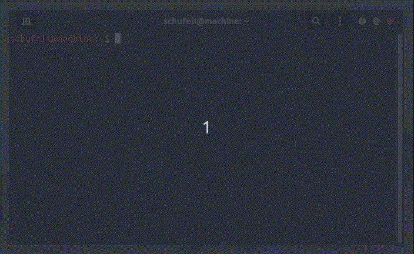

# Kali CLI

Small CLI tool to install tools from the kali repository and not destroy your installation because you forgot to remove the repos again before updating or upgrading. 



# Installation

## Binary Releases

You can download the latest compiled binary release [here](https://github.com/schufeli/kalicli/releases). 

After the download, you must add it to the `usr/local/bin/` directory so that the command can be found and executed.

In the download directory execute the following command:

```bash
sudo cp ./kalicli /usr/local/bin/
 ```

## Using `go install`

If you have a [Go](https://go.dev/) environment ready to go (at least go 1.19), it's as easy as:

```bash
go install github.com/schufeli/kalicli@latest
```
PS: You need at least go 1.19 to compile kalicli.

# Usage

